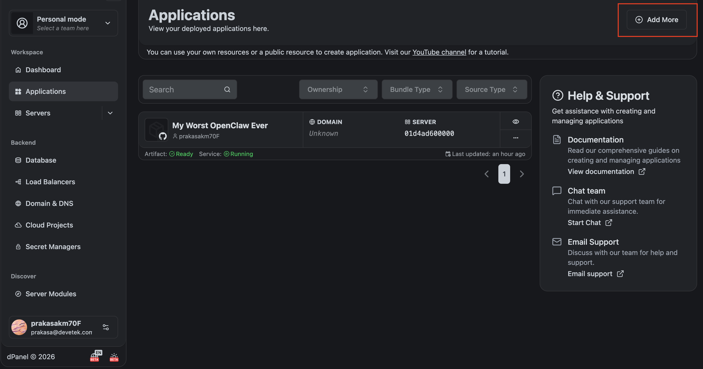
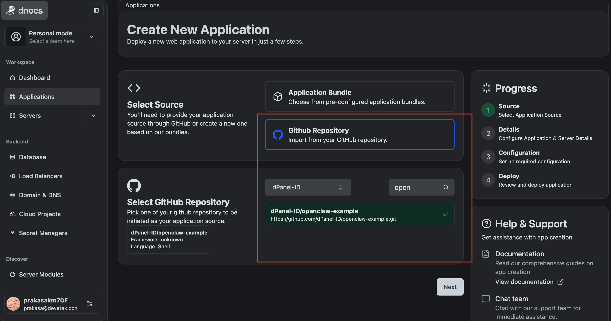
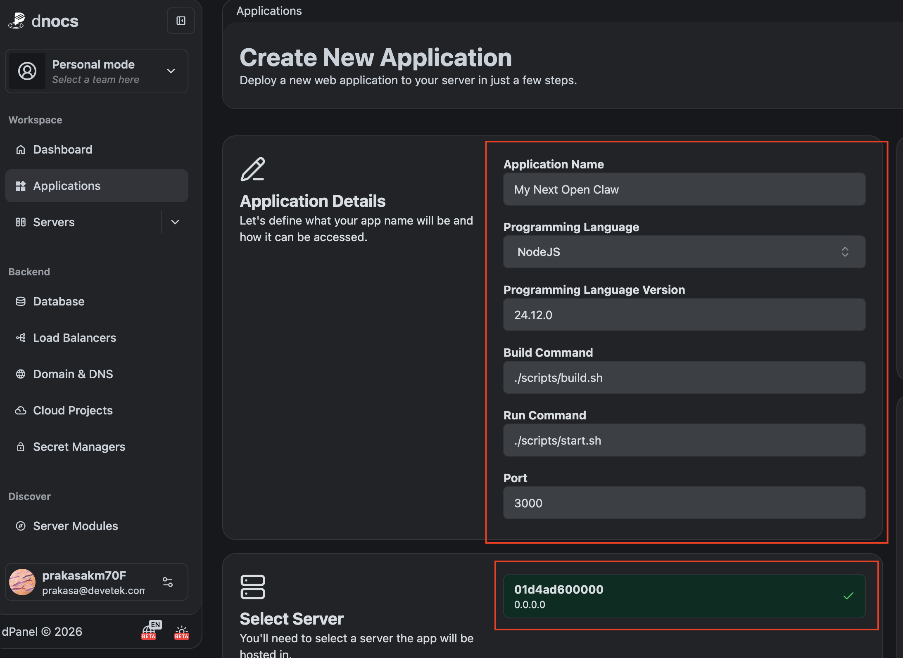
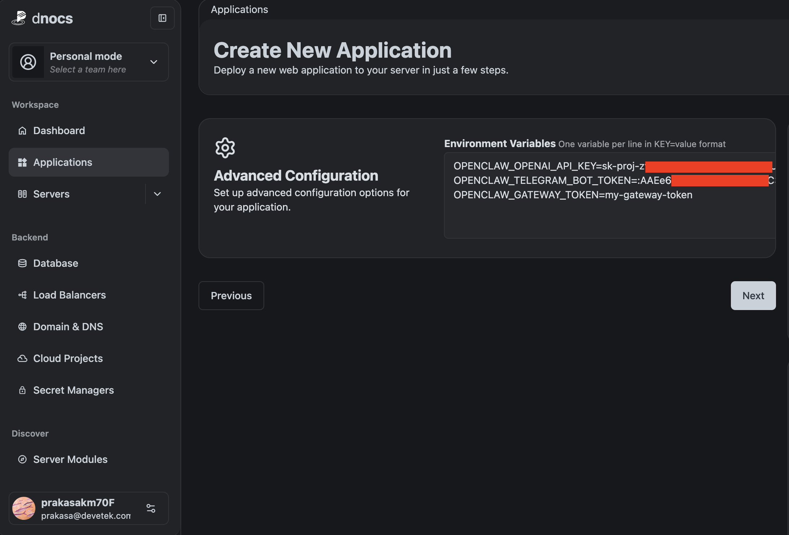
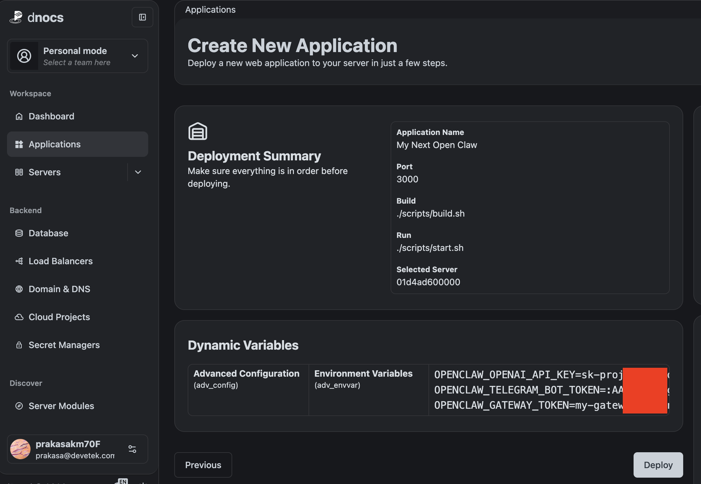

## Configuration

Focus on the `gateway` section of the configuration file. The gateway is responsible for handling incoming requests and routing them to the appropriate skills. This example is configured to run in "local" mode, which means it will only accept requests from the local machine. The `trustedProxies` setting allows you to specify which IP addresses are allowed to send requests to the gateway. In this example, we allow requests from `127.0.0.1` and `::1` (IPv6 loopback address).

If you have another proxy or load balancer in front of the gateway, you can add its IP address or CIDR range to the `trustedProxies` list. This is important for security, as it ensures that only trusted sources can access the gateway.

## Deploying

To deploy this example, it requires a dPanel account and a VPS (server) registered and set up. The deployment process involves creating an application on dPanel and linking it to your VPS (server). Follow the instructions below to complete the deployment:

#### 1. Go to application list and click on "Add more" button.



#### 2. Select from github and find the repository



#### 3. Fill the application details and and select the server you want to deploy on.



#### 4. Set environment variables for the application.

Environment variables are used to configure OpenClaw to connect to OpenAI and other services. This repository only uses 2 features, OpenAI as LLM and Telegram as channel. Therefore, you need to set the following environment variables:
```sh
OPENCLAW_OPENAI_API_KEY=YOUR-OPENAI-TOKEN-HERE
OPENCLAW_TELEGRAM_BOT_TOKEN=YOUR-TELEGRAM-BOT-TOKEN-HERE
OPENCLAW_GATEWAY_TOKEN=YOUR-OPENCLAW-GATEWAY-TOKEN-HERE
```



You can explore more environment variables to enable more features and customize the behavior. Refer to OpenClaw documentation for more details. And edit file  [`config.json`](./config.json) to add more configuration.

#### 5. Preview the configuration and click on "Deploy" button to start the deployment process.



## Expose Web UI

To expose, you can create Load Balancer on dPanel and point it to the application you just deployed. This will give you a public URL that you can use to access the web UI of the gateway.

Detail on how to create Load Balancer "Coming Soon!".

## References

- [Channel Messaging](https://docs.openclaw.ai/channels)
- [Linux Systemd](https://docs.openclaw.ai/platforms/linux#system-control-systemd-user-unit)
- [Security](https://docs.openclaw.ai/gateway/security)
- [Web Tools](https://docs.openclaw.ai/tools/web)
- [Non Interactive Onboard](https://docs.openclaw.ai/cli/onboard)
- [Trusted Proxy](https://docs.openclaw.ai/gateway/trusted-proxy-auth)